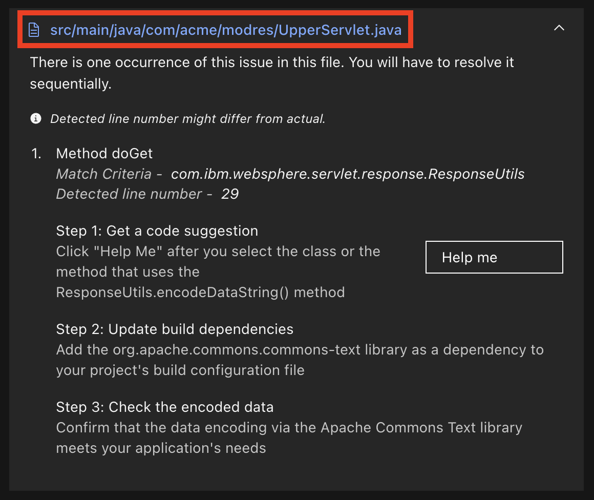

# Hands-on watsonx Code Assistance for Enterprise Java Applications Lab

# Table of Contents

[1 Introduction](#introduction)

- [1.1 About this hands-on lab](#about-this-hands-on-lab)

[2 Getting started](#getting-started)

- [2.1 Setting up your lab environment on TechZone](#setting-up-your-lab-environment-on-techzone)

- [2.2 Setting up your lab environment locally](#setting-up-your-lab-environment-locally)

[3 Introducing the ModResorts application](#introducing-the-modresorts-application)

[4 Experiencing watsonx Code Assistant for Enterprise Java Applications](#experiencing-watsonx-code-assistant-for-enterprise-java-applications)

- [4.1 Using VS Code IDE](#using-vs-code-ide)

  - [4.1.1 Setting up the `main` application](#setting-up-the-main-application)

  - [4.1.2 Modernizing WebSphere Application Server to Liberty](#modernizing-websphere-application-server-to-liberty)

  - [4.1.3 Upgrading Java version for the application](#upgrading-java-version-for-the-application)

  - [4.1.4 Explaning code and application](#explaning-code-and-application)

  - [4.1.5 Generating unit tests](#generating-unit-tests)

  - [4.1.6 Optional: Handling external issues and self-directed fixes](#optional-handling-external-issues-and-self-directed-fixes)

- [4.2 Using Eclipse IDE](#using-eclipse-ide)

  - [4.2.1 Setting up the `main` application](#setting-up-the-main-application-1)

  - [4.2.2 Modernizing WebSphere Application Server to Liberty](#modernizing-websphere-application-server-to-liberty-1)

  - [4.2.3 Upgrading Java version for the application](#upgrading-java-version-for-the-application-1)

  - [4.2.4 Explaning code and application](#explaning-code-and-application-1)

  - [4.2.5 Generating unit tests](#generating-unit-tests-1)

  - [4.2.6 Optional: Handling external issues and self-directed fixes](#optional-handling-external-issues-and-self-directed-fixes-1)

[5 Troubleshooting](#troubleshooting)

---

# Notices and disclaimers

© 2024 International Business Machines Corporation. No part of this document may be reproduced or transmitted in any form without written permission from IBM.

**U.S. Government Users Restricted Rights — use, duplication or disclosure restricted by GSA ADP Schedule Contract with IBM.**

This document is current as of the initial date of publication and may be changed by IBM at any time. Not all offerings are available in every country in which IBM operates.

Information in these presentations (including information relating to products that have not yet been announced by IBM) has been reviewed for accuracy as of the date of initial publication and could include unintentional technical or typographical errors. IBM shall have no responsibility to update this information. 

**This document is distributed “as is” without any warranty, either express or implied. In no event, shall IBM be liable for any damage arising from the use of this information, including but not limited to, loss of data, business interruption, loss of profit or loss of opportunity.** IBM products and services are warranted per the terms and conditions of the agreements under which they are provided. The performance data and client examples cited are presented for illustrative purposes only. Actual performance results may vary depending on specific configurations and operating conditions.

IBM products are manufactured from new parts or new and used parts. 
In some cases, a product may not be new and may have been previously installed. Regardless, our warranty terms apply.”

**Any statements regarding IBM's future direction, intent or product plans are subject to change or withdrawal without notice.**

Performance data contained herein was generally obtained in a controlled, isolated environments. Customer examples are presented as illustrations of how those customers have used IBM products and the results they may have achieved. Actual performance, cost, savings or other results in other operating environments may vary. 

References in this document to IBM products, programs, or services does not imply that IBM intends to make such products, programs or services available in all countries in which IBM operates or does business. 

Workshops, sessions and associated materials may have been prepared by independent session speakers, and do not necessarily reflect the views of IBM. All materials and discussions are provided for informational purposes only, and are neither intended to, nor shall constitute legal or other guidance or advice to any individual participant or their specific situation.

It is the customer’s responsibility to ensure its own compliance with legal requirements and to obtain advice of competent legal counsel as to the identification and interpretation of any relevant laws and regulatory requirements that may affect the customer’s business and any actions the customer may need to take to comply with such laws. IBM does not provide legal advice or represent or warrant that its services or products will ensure that the customer follows any law.

Questions on the capabilities of non-IBM products should be addressed to the suppliers of those products. IBM does not warrant the quality of any third-party products, or the ability of any such third-party products to interoperate with IBM’s products. **IBM expressly disclaims all warranties, expressed or implied, including but not limited to, the implied warranties of merchantability and fitness for a purpose.**

The provision of the information contained herein is not intended to, and does not, grant any right or license under any IBM patents, copyrights, trademarks or other intellectual property right.

IBM, the IBM logo, and ibm.com are trademarks of International Business Machines Corporation, registered in many jurisdictions worldwide. Other product and service names might be trademarks of IBM or other companies. A current list of IBM trademarks is available on the Web at “Copyright and trademark information” at
[Learn more →](https://www.ibm.com/legal/copyright-trademark)

---

# Introduction

**IBM** introduced **watsonx Code Assistant for Enterprise Java Applications** to complement **watsonx Code Assistant**.
**watsonx Code Assistant** focuses on helping organizations enhance
developer productivity, improve code quality and manageability, and
streamline their Java application lifecycle. Meanwhile, watsonx Code Assistant for Enterprise Java Applications
leverages the power of IBM's Granite foundation large language model to
provide features such as code change explanation, migrating projects
from the **WebSphere Application Server** to **WebSphere Liberty**, upgrade the Maven Liberty project to the latest Java
version, and create integration tests for specific use cases. By using
this tool, Java developers can expect improvements in their coding speed
and efficiency.


## About this hands-on lab

The objective of this hands-on lab is to provide an end-to-end overview of the functionalities offered by **watsonx Code Assistant for Enterprise Java Applications**. You will explore the following use cases:

### Modernize to Liberty

Modernizing Java enterprise applications to run on modern runtimes is a critical area of focus for businesses. Modern lightweight runtimes like WebSphere Liberty offer a number of advantages, including a reduced footprint, faster startup times, and improved overall performance. They also enable new microservice-based architectures and the operational efficiencies result from that.

In this use case, you will take an application built for the traditional IBM WebSphere Application Server and deploy it on WebSphere Liberty. Using a migration bundle from IBM Transformation Advisor, you will add the necessary configurations to the application and review an analysis identifying issues that must be resolved for it to run correctly on Liberty. By using a combination of automation and watsonx AI, you will fix the identified code issues and deploy the application using Liberty dev tools.

### Upgrade Java Version

Upgrades to Java versions used by applications are necessary over time. This is important as older Java versions may no longer receive security updates and developers may want to leverage the latest features in newer Java versions. In this use case, you will upgrade the same application, now modernized to Liberty, from Java 8 to Java 21. watsonx Code Assistant will identify the code issues that need to be addressed, and using a combination of automation and watsonx AI, you will fix the code issues that were identified. The updated application will be tested on WebSphere Liberty using Liberty dev tools.

### Additional AI Features

This lab will also introduce you to advanced AI-powered features, such as:

- **Code explanation**: Gain a deeper understanding of the purpose and functionality of your code and application with AI-generated insights.
- **Unit test generation**: Automate the creation of unit tests to streamline your development process.

---

# Getting started

This section will guide you through setting up the lab environment to explore **watsonx Code Assistant for Enterprise Java Applications**. Depending on your preference, you can perform the lab using the pre-configured lab environment in IBM Technology Zone (TechZone) or your local machine.

## Setting up your lab environment on TechZone

This section will guide you through starting the lab environment using IBM Technology Zone (TechZone). If you prefer to complete the lab on your local machine, skip this section and go directly to the [Setting up your lab environment locally](#setting-up-your-lab-environment-locally).

### Step 1: Reserving the lab environment

- Open the [Application Runtimes Labs TechZone Collection](https://techzone.ibm.com/collection/application-runtimes-labs).
- Navigate to the **Environments** tab and locate the lab named **WCA4EJA Lab Template**.
- Click **Reserve it** to start the reservation process.

   On the reservation page:
   - Select **Reserve now** under the single environment reservation options.
   - Provide the following details:
        - **Purpose**: Select the reason for using the lab. **Education** is recommended.
        - **Purpose Description**: Provide a brief description of your use case.
        - **Preferred Geography**: Select the geographic location for the lab.
   - Accept the TechZone policy by checking the box in the bottom-right corner.
   - Click **Submit** to confirm your reservation.

> **NOTE**: Provisioning the lab environment may take up to 20 minutes.

### Step 2: Accessing the VM

- Once provisioning is complete:  
  - Navigate to the **My TechZone** tab and select **My Reservations**.
  - Alternatively, go directly to https://techzone.ibm.com/my/reservations.

- Locate your reserved lab and click **Open this environment** to view its details.
  <div align="center">
    
  </div>

- Click the **Console** button to access the VM.
    <div align="center">
      
    </div>

- Log in to the VM using the **VM Password** listed in the **Reservation Details** section.

### Step 3: Setting up your workspace in the VM

#### 1. Accessing the lab instructions

To follow the lab efficiently, open this lab instruction in your preferred browser (Firefox or Chrome) within the VM.

> **NOTE**: If you need to transfer text from your local browser into the VM, you can use the **Send Text** feature:
> 1. Copy the desired text from the Lab Guide in your local browser.
> 2. Click on the area within the VM where you want to paste the text.
> 3. Click the **Send Text** button located in the VM command bar.
    <div align="center">
    
    </div>
> 4. Paste the copied text into the **Send Text** window that appears.
> 5. Click the **Fast Send Text** button to input the text into the VM.

#### 2.  Adjusting the desktop to fit your screen

If the desktop does not fit your display, you can resize it by clicking the **Resize** button located in the VM command bar. For the best experience, a minimum resolution of 1920x1080 is recommended.

<div align="center">
    
</div>

## Setting up your lab environment locally

If you prefer to perform the lab on your local machine, ensure you have the following tools installed:

- **Java**: [Java SDK 21](https://developer.ibm.com/languages/java/semeru-runtimes/downloads/).

- **Maven**: [Apache Maven](https://maven.apache.org/download.cgi) for building your application. A minimum version of 3.8.6 is recommended.

- **An IDE of your choice**:

  - [Microsoft Visual Studio Code (VS Code)](https://code.visualstudio.com/).

  - [Eclipse IDE for Java Developers or Eclipse IDE for Enterprise Java and Web Developers](https://www.eclipse.org/downloads/packages/) (Package [2024-06](https://www.eclipse.org/downloads/packages/release/2024-06/r) or later).

- **watsonx Code Assistant for Enterprise Java Applications extension**:

  - **VS Code**: Install the extension from the [VS Code Marketplace](https://marketplace.visualstudio.com/items?itemName=IBM.wca-eja).

  - **Eclipse**: Install the plugin via the [Eclipse Marketplace](https://marketplace.eclipse.org/content/ibm%C2%AE-watsonx%E2%84%A2-code-assistant-enterprise-java-applications).


# Introducing the ModResorts application

In this lab, you will use **watsonx Code Assistant for Enterprise Java Applications** to work with the ModResorts application. There are two versions of the application, each covering different stages of modernization and Java upgrades. These versions are organized and maintained across the following branches:

## Version 1

The Version 1 branches represent the basic progression of the ModResorts application as it transitions through modernization and Java upgrades:

- `main`: This branch contains the original ModResorts application, a simple web application built for IBM WebSphere Application Server that relies on Java 8. This will be the starting point for the primary part of this lab, where you will learn the core features of watsonx Code Assistant for Enterprise Java Applications.

- `liberty-java8`: This branch represents Version 1 of the application after it has been modernized to Liberty while still running on Java 8. 

- `liberty-java21`: This branch represents the final state of Version 1 of the application after it has been modernized to Liberty and upgraded to Java 21.

## Version 2

Version 2 of ModResorts introduces additional migration challenges, providing a more complete modernization and Java upgrade experience. These branches are intended for users who wish to dive deeper into complex migration tasks. Participation in this section is optional.

- `main-v2`: This branch represents Version 2 of the application as a traditional WebSphere Application Server application built with and running on Java 8. 

- `liberty-java8-v2`: This branch captures Version 2 of the application after it has been modernized to Liberty but still built with and running on Java 8. This branch will be the starting point for the optional part of this lab.

- `liberty-java21-v2`: This branch captures the final state of Version 2 of the application after it has been modernized to Liberty and upgraded to Java 21.

---

# Experiencing watsonx Code Assistant for Enterprise Java Applications

You can follow the lab using either VS Code or Eclipse, depending on your preferred development environment. If you’re using VS Code IDE, proceed with the following section. If you prefer Eclipse IDE, please jump to the [Using Eclipse IDE](#using-eclipse-ide) section.

## Using VS Code IDE

### Setting up the `main` application

#### Step 1: Cloning the repository

To ensure you are working with the latest version of the ModResorts application, clone the repository from GitHub:

```bash
git clone https://github.com/IBM/sample-app-mod.git sample-app-mod-v1
cd sample-app-mod-v1
```

#### Step 2: Installing WebSphere Application Server dependencies

The `main` version of ModResorts requires dependencies from WebSphere Application Server (WAS) APIs version 9.0.0 to build and run successfully. These dependencies must be available in a Maven repository to be referenced by the `pom.xml` file.

**If you are working in a TechZone VM**

- The required module JAR file `was_public.jar` and its associated `pom` file are provided in the `D:\\was-dependency` directory. These dependencies are pre-installed in the local Maven repository in the VM.

- If you need to reinstall them, you can run the following command:

  ```bash
  mvn install:install-file -Dfile=D:\\was-dependency\was_public.jar -DpomFile=D:\\was-dependency\was_public-9.0.0.pom
  ```

**If you are working on your local machine**

- The required module JAR file and its associated `pom` file can be found in your WebSphere installation. For example, in a typical installation, these files might be located at `/opt/WebSphere/AppServer/dev`. 

- Install the dependency to your local Maven repository (`$HOME/.m2`) using the following command:

  ```bash
  mvn install:install-file -Dfile=<path-to-was_public.jar> -DpomFile=<path-to-was_public-9.0.0.pom>
  ```

  For detailed guidance, refer to the [official documentation](https://www.ibm.com/docs/en/wasdtfe?topic=environment-installing-server-apis-into-maven-repository).

#### Step 3: Opening the project in VS Code

- Launch the **VS Code IDE** from your system.

- Navigate to **File** > **Open Folder...**, then select the `sample-app-mod-v1` folder from your local directory. 
   
   When the project opens, ensure the **Welcome view** remains open. This allows the **watsonx Code Assitant** features to open in a new pane beside your editor for seamless coding.

#### Step 4: Logging into watsonx Code Assistant

To access **watsonx Code Assistant for Enterprise Java Applications**, you need to log in using an **IBM watsonx Code Assistant API key**. 

- Click the **watsonx Code Assistant** icon  in the IDE's side panel, then enter your API key. 

- Once logged in, a greeting message will appear in the chat panel.
    
   <div align="center">
       
   </div>

### Modernizing WebSphere Application Server to Liberty

The application was originally developed using **traditional WebSphere Application Server** code. With **watsonx Code Assistant for Enterprise Java Applications**, you can leverage an AI-powered feature to modernize the application to the latest **WebSphere Liberty Server**.

#### Step 1: Starting the modernization process

- In the **Explorer** pane, right-click on either an empty area within the project folder or any file in the project. From the context menu,  select **watsonx Code Assistant** → **Modernize to Liberty**.

  <div align="center">
    
  </div>

- The **Modernize to Liberty** interface will open.

#### Step 2: Selecting a modernization method

The tool offers two methods for modernizing your application:

1. **Using a migration bundle:**

   Use an [IBM Cloud® Transformation Advisor](https://www.ibm.com/docs/en/cta?topic=about-transformation-advisor) migration bundle to modernize your application. The migration bundle includes a list of modernization issues that need to be addressed and contains automatically generated configuration information to help the application function properly in Liberty. This is the recommended approach, as the bundle captures important configuration details from the environment where the Java application was running.

2. **Analyzing the application:** 
  
   If a migration bundle is not available, you can analyze your application directly. This analysis provides a list of issues to address but does not include configuration information because the application server environment isn’t analyzed. For complete modernization, a Transformation Advisor migration bundle is required to assess the application server environment.

In this lab, you will use the migration bundle option.

- On the **Modernize ModResorts** page, click **Upload migration bundle**.

  <div align="center">
    
  </div>

- Locate and select the `modresorts.ear_migrationBundle.zip` file from the `migration-bundle` folder in the project directory. The file path is [`sample-app-mod-v1\migration-bundle\modresorts.ear_migrationBundle.zip`](https://github.com/IBM/sample-app-mod/blob/main/migration-bundle/modresorts.ear_migrationBundle.zip).

- Click **Open** to upload the bundle.

#### Step 3: Extracting configuration files

Once the migration bundle is uploaded, watsonx Code Assistant for Enterprise Java Applications will extract the following key configuration files:

- `server.xml`: Defines the application's configuration.

- `Containerfile`: Can be used to build a Liberty image.

Review the extracted files, then check the selection box and click **Proceed** to add them to the project.

<div align="center">
  
</div>

#### Step 4: Reviewing and auto-fixing detected issues

Once the **Modernize ModResorts** page opens, it will display issues detected by watsonx Code Assistant for Enterprise Java Applications. These issues may require automated fixes, assisted fixes, or manual adjustments. Additionally, the **Additional information** tab highlights issues you should be aware of when migrating your application, though these do not require code changes.

To resolve issues that can be fixed automatically:

- Navigate to the **Automated fixes** tab.

- Click the **Run automated fixes** button.

  <div align="center">
    
  </div>

> **NOTE**: If the **Back to top** button blocks your view, you can drag it to a different spot on the screen.

#### Step 5: Resolving assisted fixes

Assisted fixes are issues where watsonx Code Assistant for Enterprise Java Applications provides guidance and code suggestions to help you resolve them.

- Open the **Assisted fixes** tab.

  <div align="center">
    
  </div>

- Expand each issue to view its details.
  <div align="center">
    
  </div>

- Use the caret icon next to the file name to reveal step-by-step instructions for resolving the issue.

  <div align="center">
    
  </div>

- watsonx Code Assistant for Enterprise Java Applications will outline the steps to fix the issue. Carefully review these steps and click the file name to open it in the editor.

  <div align="center">
    
  </div>

**Resolving the issue "The WebSphere Servlet API was superseded by a newer implementation"**

 - Navigate to the file `src/main/java/com/acme/modres/UpperServlet.java` as indicated in the issue details.

- Highlight the `doGet()` method (lines 19 to 33) or the entire class as specified in the instructions.

- Click the **Help me** button in the issue resolution interface.

  <div align="center">
    
  </div>

- watsonx Code Assistant will generate a suggested solution in the chat window, including updated code for the highlighted section.

- Review the suggested solution. Use the copy button  next to the suggested code blocks to copy the code to your clipboard.

  - **Handling import statements**: Depending on your code selection (e.g. selecting the `doGet` method versus selecting the entire class), the code suggestion that you get may vary. Review the code suggestion and copy the relevant code from the chat to your editor. If import statements were generated, place them at the top of the class appropriately.

    <div align="center">
      
    </div>

  - **Updating build dependencies**: watsonx Code Assistant should provide a code block with additional dependency instructions. Copy this dependency block, navigate to the `pom.xml` file in your `sample-app-mod-v1` project folder, and add it within the `<dependencies>` block.

    <div align="center">
      
    </div>

- Review the suggested solution and make adjustments to the code as needed.

  Keep in mind that these are **assisted suggestions** and may not provide a complete solution. If needed, ask follow-up questions in the chat for further clarification or guidance.

#### Step 6: Verifying changes

- After applying the changes, save the file.

- Click the **Rebuild and refresh** button to verify the updates.

  <div align="center">
    
  </div>

#### Step 7: Finalizing the migration

You can now verify that the migration process is complete by following these steps:

- To deploy the application on Liberty, you need to enable the [Liberty Maven plug-in](https://github.com/OpenLiberty/ci.maven) in your project. Add the Liberty Maven plug-in to the `<plugins>` section within the `<build>` block of your `pom.xml` file:

  ```xml
  <plugin>
      <groupId>io.openliberty.tools</groupId>
      <artifactId>liberty-maven-plugin</artifactId>
      <version>3.11.2</version>
  </plugin>
  ```

- Open a terminal in VS Code, ensure it is located at the your `sample-app-mod-v1` project directory, and start the application in Liberty dev mode:

  ```bash
  mvn liberty:dev
  ```

- Once the server starts, visit http://localhost:9080/resorts in your browser. You should see the application’s homepage.

### Upgrading Java version for the application

You may wish to upgrade the Java version of your application to eliminate technical debt, enhance security, or to take advantage of newer Java features. In this sub-section, you’ll upgrade the application’s Java version to Java 21.

#### Step 1: Observing a Java 21 issue in the application

In this lab environment, the Liberty server is running on Java 21. You'll check if the application functions correctly on Java 21.

- In the running application, click the **Where to?** drop-down menu. You may notice that the weather information isn’t loading correctly. This issue occurs because the application relies on APIs that have been removed or changed in Java 21.

  <div align="center">
      
  </div>

- Stop the Liberty instance:
    
    - Press `CTRL+C` in the terminal where Liberty is running.
    - Alternatively, run the `liberty:stop` goal from the current directory in another shell session:
        
      ```bash
      mvn liberty:stop
      ```

#### Step 2: Starting the Java upgrade process

- In the **Explorer** pane, right-click on either an empty area within the project folder or any file in the project. From the context menu, select **watsonx Code Assistant** → **Upgrade Java Version**.

- The **Upgrade Java Version** interface will open.

#### Step 3: Selecting the target Java version

The **Source** and **Target** Java versions specified in this interface define the ruleset that the application is analyzed against.

- The **Source** Java runtime version is automatically detected as **IBM Java 8** for the ModResorts application and should not be changed.

- Set **Java 21** as the **Target** version.

- Because the application was built earlier when it was run in Liberty dev mode, you can simply click **Analyze**. If the application hasn’t been built yet, select **Build and analyze** to compile it before starting the analysis.

  <div align="center">
    
  </div>

- After the analysis, a list of issues will appear.

#### Step 4: Resolving automated fixes

- Navigate to the **Automated fixes** tab.

- Click the **Run automated fixes** button to apply the changes automatically.

#### Step 5: Resolving assisted fixes

For assisted issues, follow the guidance provided by watsonx Code Assistant to manually make changes.

**Resolving the issue "Behavior change in the javax.management.MBeanOperationInfo constructor"**

- Open the indicated `src/main/java/com/acme/modres/mbean/DMBeanUtils.java` file.

- Highlight the `getOps()` method from lines 11 to 34.

- Click **Help me** to get a solution in the watsonx Code Assistant chat.

- Review and apply the suggested solution to resolve the issue.

#### Step 6: Verifying and saving changes

- Save the file after making the required changes.

- Click **Rebuild and refresh** to verify that all issues have been resolved.

#### Step 7: Restarting the application

- Restart the application in Liberty dev mode:
    
  ```bash
  mvn liberty:dev
  ```
    
- Once the server starts, revisit http://localhost:9080/resorts in your browser.

- Verify that the weather information now loads correctly.

  <div align="center">
      
  </div>


### Explaning code and application

With all the changes made to your code, you may want a better understanding of what it does. watsonx Code Assistant includes a feature that can explain individual files, specific code blocks, or even the entire application.

#### Step 1: Explaining specific files or code blocks

- In the **Explorer** pane, select a file or highlight specific code in the editor.

- Right-click and select **watsonx Code Assistant** → **Explain** or **Explain This**.

- The explanation will be displayed in the chat window.

#### Step 2: Explaining the entire application

- To get an overview of the entire application:
    - Right-click on an empty space or on any file within the project folder in the **Explorer** pane.
    - Select **watsonx Code Assistant** → **Explain Application**.

- The assistant will analyze the code base and provide a summary, including key functionalities and services.

- Once the analysis is complete, click **Open explanation** in the notification.

  <div align="center">
    
  </div>

- If needed, click **Save Summary** to keep a copy of the explanation.

### Generating unit tests

In this sub-section, you'll use watsonx Code Assistant to generate unit tests for your application.

> **NOTE**: The unit test generation feature in **watsonx Code Assistant for Enterprise Java Applications** provides a solid starting point, but the generated tests may contain issues that require manual fixes before they can compile and run successfully. At this stage, developers should expect to review and adjust the tests as needed. 
> 
> A test fix capability will be released in the near future to help automate issue resolution. For now, think of this as an AI-assisted way to accelerate test creation rather than a fully automated solution.

#### Step 1: Generating unit tests

- Navigate to the file `src/main/java/com/acme/modres/db/ModResortsCustomerInformation.java` in the **Explorer** pane.

- Right-click the file and select **watsonx Code Assistant** → **Unit Test**.

- The assistant will process the request and display the generated unit test code in the chat window.

#### Step 2: Creating the test file

- Review the generated test code.

- Create a new test file in the project directory at the path:
  ```
  src/test/java/com/acme/modres/db/WCA_ModResortsCustomerInformation_Test.java
  ```

- Copy and paste the generated code into the file and save it.

#### Step 3: Running the unit tests

- Because you started the application in Liberty dev mode, you can run the tests by pressing the `enter/return` key from the command-line session where you started dev mode.

- The expected output should be similar to the following example:
    
  ```
  -------------------------------------------------------
  T E S T S
  -------------------------------------------------------
  Running com.acme.modres.db.WCA_ModResortsCustomerInformation_Test
  Tests run: 1, Failures: 0, Errors: 0, Skipped: 0, Time elapsed: 3.157 s -- in com.acme.modres.db.WCA_ModResortsCustomerInformation_Test
  
  Results:
  
  Tests run: 1, Failures: 0, Errors: 0, Skipped: 0
  ```

- If the output contains errors or failures, review the generated test code and comment out any test cases causing compilation or runtime errors to proceed.

  Addressing or commenting out unresolved test cases ensures that watsonx Code Assistant features, such as **Rebuild and refresh**, function without interference, as unresolved test issues may disrupt these workflows.

- When you are done checking out the service, exit dev mode by pressing `CTRL+C` in the command-line session where you ran Liberty.

### Optional: Handling external issues and self-directed fixes

> **NOTE**: This section is optional and intended for users who want to explore advanced scenarios with **watsonx Code Assistant for Enterprise Java Applications**. In this section, you will address external issues and perform self-directed fixes using AI-guided support.

This section may revisit issues already resolved in the main exercises. You are encouraged to attempt resolving the issues independently before referring to the provided solutions.

#### Step 1: Cloning and setting up the `liberty-java8-v2` application

- Clone the repository from the `liberty-java8-v2` branch:

  ```
  git clone https://github.com/IBM/sample-app-mod.git -b liberty-java8-v2 sample-app-mod-v2
  cd sample-app-mod-v2
  ```

- In order to build and run Version 2 of the application, you need to install the dependencies in the `dependencies` directory to your local Maven repository:

  ```bash
  mvn install:install-file -Dfile="dependencies/env-config-1.6.jar" -DpomFile="dependencies/env-config-1.6.pom"
  mvn install:install-file -Dfile="dependencies/env-config-1.7.jar" -DpomFile="dependencies/env-config-1.7.pom"
  ```

- Open the `sample-app-mod-v2` project in your VS Code IDE.

#### Step 2: Starting the Java upgrade process

- In the **Explorer** pane, right-click on the project folder or any file within it. From the context menu, select **watsonx Code Assistant** → **Upgrade Java Version**.

- The **Upgrade Java Version** interface will open.

#### Step 3: Selecting the target Java version

- The **Source** Java runtime version is automatically detected as **IBM Java 8** for the ModResorts application and should not be changed.

- Set **Java 21** as the **Target** version.

- Click **Build and analyze** to compile the application and start the analysis.

#### Step 4: Resolving automated and assisted fixes

**Resolving automated fixes:**

- Navigate to the **Automated fixes** tab.

- Click **Run automated fixes** to apply the changes automatically.

**Resolving assisted fixes:**

**1. Resolving the issue "Behavior change in the javax.management.MBeanOperationInfo constructor"**

- Follow the steps to resolve assisted issues, including highlighting and modifying the relevant code as guided by **watsonx Code Assistant**.

**2. Resolving the issue "Avoid using Thread.stop(), Thread.resume(), and Thread.suspend() methods"**

- Open the indicated `src/main/java/com/acme/modres/AvailabilityCheckerServlet.java` file.

- Identify the code where the `Thread.stop()` method is used (line 67). This code stops the thread `t1` created on line 59.

- Review the assisted instructions and determine where the logic for `t1` is executed. Notice that `t1` uses the `dateChecker` object from line 58 when being created. This indicates that the `DateChecker` class contains the logic for the run method of the thread.

- Open the `DateChecker` class at `src/main/java/com/acme/modres/mbean/reservation/DateChecker.java`.

- Select the entire class and click **Help me** to get a suggestion.

- Implement the suggested changes to add a custom `stop()` method to the `DateChecker` class.

- Replace the usage of `Thread.stop()` in `AvailabilityCheckerServlet.java` with the new `dateChecker.stop()` method.

> **NOTE**: For additional details, refer to [Step 4: Resolving automated fixes](#step-4-resolving-automated-fixes) and [Step 5: Resolving assisted fixes](#step-5-resolving-assisted-fixes-1) in the [Upgrading Java version for the application](#upgrading-java-version-for-the-application) section from the `main` excercise.

#### Step 5: Handling external issues

External issues are problems that originate from dependencies or external libraries used by the application, rather than its own source code. These issues will remain in the list until the associated dependency is updated or resolved.

- Locate the issue **"Avoid using Thread.stop(), Thread.resume(), and Thread.suspend() methods"** in the **Assisted fixes** tab. Notice the external issue icon next to the caret icon. This indicates that there is an external issue that needs to be fixed.

  <div align="center">
    
  </div>

- Review the issue details to identify the problematic dependency. In this case, the current version (1.6) of the `env-config` library is incompatible with Java 21.

- Update the library version to a compatible one:

  - Open the `pom.xml` file.

  - Locate the dependency for `env-config` and update its version to 1.7:

    ```xml
    <dependency>
      <groupId>com.acme.common</groupId>
      <artifactId>env-config</artifactId>
      <version>1.7</version>
    </dependency>
    ```

#### Step 6: Resolving self-directed fixes

Self-directed fixes require manual intervention since there are no automated or assisted solutions available for these issues.

- Navigate to the **Self-directed fixes** tab.

- Expand each issue and review the details. Note that both issues involve the use of the `sun.misc.Unsafe` API, which is an internal JDK API that is not recommended for use.

- Open the indicated `src/main/java/com/acme/modres/util/ModResortsEnv.java` file from the issue details.

- Review the code in lines 54-56, which uses the `sun.misc.Unsafe` API. To better understand this code, you can start a chat with watsonx Code Assistant using the **Start chat** button. Ask the following:

  > What does the following code do:
  > ```java
  > Field f = EnvConfig.class.getDeclaredField("adminApiEndpoint");
  > long offset = myUnsafe.objectFieldOffset(f);
  > return (String)myUnsafe.getObject(envConfig, offset);
  > ```

  <div align="center">
    
  </div>

  watsonx Code Assistant should explain that the code uses the Unsafe API to access the value of a private field in the `EnvConfig` class.

- Ask watsonx Code Assistant:

  > Is there an alternative way to get a private field without using sun.misc.Unsafe?

  watsonx Code Assistant will suggest using Java Reflection as an alternative to accessing private fields.
  
- Implement the suggested solution. Replace the `sun.misc.Unsafe` usage with the Reflection-based solution provided by watsonx Code Assistant.

- If any unhandled exceptions are flagged, use the **Quick Fix** feature in VS Code:

  - Right-click the error and select **Add exceptions to existing catch clause**.

- Remove all references to the Unsafe API and the `myGetUnsafe()` method.

- The final solution should not contain any Unsafe references and may resemble the completed example solution available in the [ModResorts GitHub repository](https://github.com/IBM/sample-app-mod/blob/liberty-java21-v2/src/main/java/com/acme/modres/util/ModResortsEnv.java).

#### Step 7: Verifying and saving changes

- Save the file after making the required changes.

- Click **Rebuild and refresh** to verify that all issues have been resolved.

#### Step 8: Testing the application

You can now confirm that the upgrade is complete by testing your application.

- Open a terminal in VS Code and ensure it is located in your `sample-app-mod-v2` project directory.

- Start the application in Liberty dev mode:

  ```bash
  mvn liberty:dev
  ```

-	Once the server starts, open your browser and navigate to http://localhost:9080/resorts. Test various features of the application, including navigating through pages and verifying the weather information functionality. The application should function correctly without any errors.


## Using Eclipse IDE

### Setting up the `main` application

#### Step 1: Cloning the repository

To ensure you are working with the latest version of the ModResorts application, clone the repository from GitHub:

```bash
git clone https://github.com/IBM/sample-app-mod.git sample-app-mod-v1
cd sample-app-mod-v1
```

#### Step 2: Installing WebSphere Application Server dependencies

The `main` version of ModResorts requires dependencies from WebSphere Application Server (WAS) APIs version 9.0.0 to build and run successfully. These dependencies must be available in a Maven repository to be referenced by the `pom.xml` file.

**If you are working in a TechZone VM**

- The required module JAR file `was_public.jar` and its associated `pom` file are provided in the `D:\\was-dependency` directory. These dependencies are pre-installed in the local Maven repository in the VM.

- If you need to reinstall them, you can run the following command:

  ```bash
  mvn install:install-file -Dfile=D:\\was-dependency\was_public.jar -DpomFile=D:\\was-dependency\was_public-9.0.0.pom
  ```

**If you are working on your local machine**

- The required module JAR file and its associated `pom` file can be found in your WebSphere installation. For example, in a typical installation, these files might be located at `/opt/WebSphere/AppServer/dev`. 

- Install the dependency to your local Maven repository (`$HOME/.m2`) using the following command:

  ```bash
  mvn install:install-file -Dfile=<path-to-was_public.jar> -DpomFile=<path-to-was_public-9.0.0.pom>
  ```
  
  For detailed guidance, refer to the [official documentation](https://www.ibm.com/docs/en/wasdtfe?topic=environment-installing-server-apis-into-maven-repository).
#### Step 3: Opening the project in Eclipse

- Launch the **Eclipse IDE** from your system.

- Import the project as a Maven project:

  - Go to the **File** menu in the top left corner and select **Import...**.
  - In the **Import Wizard**, choose **Maven** → **Existing Maven Projects** and click **Next**.
  - Browse to the `sample-app-mod-v1` folder in your local directory and click **Finish**.
  - The project should now appear in your **Project Explorer** and be ready for use.

#### Step 4: Logging into watsonx Code Assistant

To access **watsonx Code Assistant for Enterprise Java Applications**, you need to log in using your **IBM watsonx Code Assistant API key**.

- In Eclipse IDE, locate the **watsonx Code Assistant** icon  in the top toolbar. Click the icon, then enter your API key. 

- Once logged in, a greeting message will appear in the chat panel.

    <div align="center">
      
    </div>

### Modernizing WebSphere Application Server to Liberty

The application was originally developed using **traditional WebSphere Application Server** code. With **watsonx Code Assistant for Enterprise Java Applications**, you can leverage an AI-powered feature to modernize the application to the latest **WebSphere Liberty Server**.

#### Step 1: Starting the modernization process

- Right-click on the project within the **Project Explorer** pane.

- Select **watsonx Code Assistant** → **Modernize to Liberty**.

  <div align="center">
    
  </div>

- The **Modernize modresorts** view will open.

#### Step 2: Selecting a modernization method

The tool offers two methods for modernizing your application:

1. **Using a migration bundle:**

   Use an [IBM Cloud® Transformation Advisor](https://www.ibm.com/docs/en/cta?topic=about-transformation-advisor) migration bundle to modernize your application. The migration bundle includes a list of modernization issues that need to be addressed and contains automatically generated configuration information to help the application function properly in Liberty. This is the recommended approach, as the bundle captures important configuration details from the environment where the Java application was running.

2. **Analyzing the application:** 
  
   If a migration bundle is not available, you can analyze your application directly. This analysis provides a list of issues to address but does not include configuration information because the application server environment isn’t analyzed. For complete modernization, a Transformation Advisor migration bundle is required to assess the application server environment.

In this lab, you will use the migration bundle option.

- On the **Modernize modresorts** page, click **Upload migration bundle**.

  <div align="center">
    
  </div>

- Locate and select the `modresorts.ear_migrationBundle.zip` file from the `migration-bundle` folder in the project directory. The file path is [`sample-app-mod-v1\migration-bundle\modresorts.ear_migrationBundle.zip`](https://github.com/IBM/sample-app-mod/blob/main/migration-bundle/modresorts.ear_migrationBundle.zip).

- Click **Open** to upload the bundle.

#### Step 3: Extracting configuration files

Once the migration bundle is uploaded, watsonx Code Assistant for Enterprise Java Applications will extract the following key configuration files:

- `server.xml`: Defines the application's configuration.

- `Containerfile`: Can be used to build a Liberty image.

Review the extracted files, then check the selection box and click **Proceed** to add them to the project.

<div align="center">
  
</div>

#### Step 4: Reviewing and auto-fixing detected issues

Once the **Modernize modresorts** page opens, it will display issues detected by watsonx Code Assistant for Enterprise Java Applications. These issues may require automated fixes, assisted fixes, or manual adjustments. Additionally, the **Additional information** tab highlights issues you should be aware of when migrating your application, though these do not require code changes.

To resolve issues that can be fixed automatically:

- Navigate to the **Automated fixes** tab.

- Click the **Run automated fixes** button.

  <div align="center">
    
  </div>

#### Step 5: Resolving assisted fixes

Assisted fixes are issues where watsonx Code Assistant for Enterprise Java Applications provides guidance and code suggestions to help you resolve them.

- Open the **Assisted fixes** tab.
  <div align="center">
    
  </div>

- Expand each issue to view its details.

  <div align="center">
    
  </div>

- Use the caret icon beside the file name to expand and access detailed instructions for resolving the issue.

  <div align="center">
    
  </div>

- watsonx Code Assistant for Enterprise Java Applications will outline the steps to fix the issue. Carefully review these steps and click the file name to open it in the editor.

  <div align="center">
    
  </div>

**Resolving the issue "The WebSphere Servlet API was superseded by a newer implementation"**

 - Navigate to the file `src/main/java/com/acme/modres/UpperServlet.java` as indicated in the issue details.

- Highlight the `doGet()` method (lines 19 to 33) or the entire class as specified in the instructions.

- Click the **Help me** button in the issue resolution interface.

  <div align="center">
    
  </div>

- watsonx Code Assistant will generate a suggested solution in the chat window, including updated code for the highlighted section.

- Review the suggested solution. Use the copy button  next to the suggested code blocks to copy the code to your clipboard.

  - **Handling import statements**: Depending on your code selection (e.g. selecting the `doGet` method versus selecting the entire class), the code suggestion that you get may vary. Review the code suggestion and copy the relevant code from the chat to your editor. If import statements were generated, place them at the top of the class appropriately.

    <div align="center">
      
    </div>

  - **Updating build dependencies**: watsonx Code Assistant should provide a code block with additional dependency instructions. Copy this dependency block, navigate to the `pom.xml` file in your `sample-app-mod-v1` project folder, and add it within the `<dependencies>` block.

    <div align="center">
      
    </div>

- Review the suggested solution and make adjustments to the code as needed.

  Keep in mind that these are **assisted suggestions** and may not provide a complete solution. If needed, ask follow-up questions in the chat for further clarification or guidance.
  
#### Step 6: Verifying changes

- After applying the changes, save the file.

- Click the **Rebuild and refresh** button to verify the updates.

  <div align="center">
    
  </div>

#### Step 7: Finalizing the migration

You can now verify that the migration process is complete by following these steps:

- To deploy the application on Liberty, you need to enable the [Liberty Maven plug-in](https://github.com/OpenLiberty/ci.maven) in your project. Add the Liberty Maven plug-in to the `<plugins>` section within the `<build>` block of your `pom.xml` file:

  ```xml
  <plugin>
      <groupId>io.openliberty.tools</groupId>
      <artifactId>liberty-maven-plugin</artifactId>
      <version>3.11.2</version>
  </plugin>
  ```

- Open a terminal, ensure it is located at the your `sample-app-mod-v1` project directory, and start the application in Liberty dev mode:

  ```bash
  mvn liberty:dev
  ```

- Once the server starts, visit http://localhost:9080/resorts in your browser. You should see the application’s homepage.

### Upgrading Java version for the application

You may wish to upgrade the Java version of your application to eliminate technical debt, enhance security, or to take advantage of newer Java features. In this sub-section, you’ll upgrade the application’s Java version to Java 21.

#### Step 1: Observing a Java 21 issue in the application

In this lab environment, the Liberty server is running on Java 21. You'll check if the application functions correctly on Java 21.

- In the running application, click the **Where to?** drop-down menu. You may notice that the weather information isn’t loading correctly. This issue occurs because the application relies on APIs that have been removed or changed in Java 21.

  <div align="center">
      
  </div>

- Stop the Liberty instance:
    
    - Press `CTRL+C` in the terminal where Liberty is running.
    - Alternatively, run the `liberty:stop` goal from the current directory in another shell session:
        
      ```bash
      mvn liberty:stop
      ```

#### Step 2: Starting the Java upgrade process

- In the **Project Explorer** pane, right-click the project to open the context menu. Select **watsonx Code Assistant** → **Upgrade Java Version**. 

- The **Upgrade modresorts** view will open.

#### Step 3: Selecting the target Java version

The **Source** and **Target** Java versions specified in this interface define the ruleset that the application is analyzed against.

- The **Source** Java runtime version is automatically detected as **IBM Java 8** for the ModResorts application and should not be changed.

- Set **Java 21** as the **Target** version.

- Because the application was built earlier when it was run in Liberty dev mode, you can simply click **Analyze**. If the application hasn’t been built yet, select **Build and analyze** to compile it before starting the analysis.

  <div align="center">
    
  </div>

- After the analysis, a list of issues will appear.

#### Step 4: Resolving automated fixes

- Navigate to the **Automated fixes** tab.

- Click the **Run automated fixes** button to apply the changes automatically.

#### Step 5: Resolving assisted fixes

For assisted issues, follow the guidance provided by watsonx Code Assistant to manually make changes.

**Resolving the issue "Behavior change in the javax.management.MBeanOperationInfo constructor"**

- Open the indicated `src/main/java/com/acme/modres/mbean/DMBeanUtils.java` file.

- Highlight the `getOps()` method from lines 11 to 34.

- Click **Help me** to get a solution in the watsonx Code Assistant chat.

- Review and apply the suggested solution to resolve the issue.

#### Step 6: Verifying and saving changes

- Save the file after making the required changes.

- Click **Rebuild and refresh** to verify that all issues have been resolved.

#### Step 7: Restarting the application

- Restart the application in Liberty dev mode:
    
  ```bash
  mvn liberty:dev
  ```

- Once the server starts, revisit http://localhost:9080/resorts in your browser.

- Verify that the weather information now loads correctly.

  <div align="center">
      
  </div>

- When you are done checking out the service, exit dev mode by pressing `CTRL+C` in the command-line session where you ran Liberty.


### Explaning code and application

With all the changes made to your code, you may want a better understanding of what it does. watsonx Code Assistant includes a feature that can explain individual files, specific code blocks, or even the entire application.

#### Step 1: Explaining specific files or code blocks

- In the **Project Explorer** pane, select a file or highlight specific code in the editor.

- Right-click and select **watsonx Code Assistant** → **Explain**.

- The explanation will be displayed in the chat window.

#### Step 2: Explaining the entire application

- To get an overview of the entire application:
    - Right-click on the project folder in the **Project Explorer** pane.
    - Select **watsonx Code Assistant** → **Explain Application**.

- The assistant will analyze the code base and provide a summary, including key functionalities and services.

- Once the analysis is complete, click **Open explanation** in the notification.

  <div align="center">
    
  </div>

- If needed, click **Save explanation** to keep a copy of the explanation.

### Generating unit tests

In this sub-section, you'll use watsonx Code Assistant to generate unit tests for your application.

> **NOTE**: The unit test generation feature in **watsonx Code Assistant for Enterprise Java Applications** provides a solid starting point, but the generated tests may contain issues that require manual fixes before they can compile and run successfully. At this stage, developers should expect to review and adjust the tests as needed. 
> 
> A test fix capability will be released in the near future to help automate issue resolution. For now, think of this as an AI-assisted way to accelerate test creation rather than a fully automated solution.

#### Step 1: Generating unit tests

- Navigate to the file `src/main/java/com/acme/modres/db/ModResortsCustomerInformation.java` in the **Project Explorer** pane.

- Right-click the file and select **watsonx Code Assistant** → **Unit Test**.

- The assistant will process the request and display the generated unit test code in the chat window.

#### Step 2: Creating the test file

- Review the generated test code.

- Create a new test file in the project directory at the path:  
  ```
  src/test/java/com/acme/modres/db/WCA_ModResortsCustomerInformation_Test.java
  ```

- Copy and paste the generated code into the file and save it.

#### Step 3: Running the unit tests

- You can run the tests by executing the following command in the same Windows terminal you used in the previous steps:

  ```bash
  mvn clean verify
  ```
    
- The expected output should be similar to the following example:
  ```
  -------------------------------------------------------
  T E S T S
  -------------------------------------------------------
  Running com.acme.modres.db.WCA_ModResortsCustomerInformation_Test
  Tests run: 1, Failures: 0, Errors: 0, Skipped: 0, Time elapsed: 3.157 s -- in com.acme.modres.db.WCA_ModResortsCustomerInformation_Test

  Results:

  Tests run: 1, Failures: 0, Errors: 0, Skipped: 0
  ```

- If the output contains errors or failures, review the generated test code and comment out any test cases causing compilation or runtime errors to proceed.

  Addressing or commenting out unresolved test cases ensures that watsonx Code Assistant features, such as **Rebuild and refresh**, function without interference, as unresolved test issues may disrupt these workflows.

### Optional: Handling external issues and self-directed fixes

> **NOTE**: This section is optional and intended for users who want to explore advanced scenarios with **watsonx Code Assistant for Enterprise Java Applications**. In this section, you will address external issues and perform self-directed fixes using AI-guided support.

This section may revisit issues already resolved in the main exercises. You are encouraged to attempt resolving the issues independently before referring to the provided solutions.

#### Step 1: Cloning and setting up the `liberty-java8-v2` application

- Clone the repository from the `liberty-java8-v2` branch:

  ```
  git clone https://github.com/IBM/sample-app-mod.git -b liberty-java8-v2 sample-app-mod-v2
  cd sample-app-mod-v2
  ```

- In order to build and run Version 2 of the application, you need to install the dependencies in the `dependencies` directory to your local Maven repository:

  ```bash
  mvn install:install-file -Dfile="dependencies/env-config-1.6.jar" -DpomFile="dependencies/env-config-1.6.pom"
  mvn install:install-file -Dfile="dependencies/env-config-1.7.jar" -DpomFile="dependencies/env-config-1.7.pom"
  ```

- Import the `sample-app-mod-v2` project as a Maven project in your Eclipse IDE. Since `sample-app-mod-v2` shares the same project ID as `sample-app-mod-v1`, you can prevent conflicts by:
  - Using a new workspace to import `sample-app-mod-v2`.

  - Removing the `sample-app-mod-v1` project from the current workspace before importing `sample-app-mod-v2`.

  - Resolving any workspace project conflicts that arise during the import process.

#### Step 2: Starting the Java upgrade process

- In the **Project Explorer** pane, right-click the project to open the context menu. Select **watsonx Code Assistant** → **Upgrade Java Version**. 

- The **Upgrade Java Version** interface will open.

#### Step 3: Selecting the target Java version

- The **Source** Java runtime version is automatically detected as **IBM Java 8** for the ModResorts application and should not be changed.

- Set **Java 21** as the **Target** version.

- Click **Build and analyze** to compile the application and start the analysis.

#### Step 4: Resolving automated and assisted fixes

**Resolving automated fixes:**

- Navigate to the **Automated fixes** tab.

- Click **Run automated fixes** to apply the changes automatically.

**Resolving assisted fixes:**

**1. Resolving the issue "Behavior change in the javax.management.MBeanOperationInfo constructor"**

- Follow the steps to resolve assisted issues, including highlighting and modifying the relevant code as guided by **watsonx Code Assistant**.

**2. Resolving the issue "Avoid using Thread.stop(), Thread.resume(), and Thread.suspend() methods"**

- Open the indicated `src/main/java/com/acme/modres/AvailabilityCheckerServlet.java` file.

- Identify the code where the `Thread.stop()` method is used (line 67). This code stops the thread `t1` created on line 59.

- Review the assisted instructions and determine where the logic for `t1` is executed. Notice that `t1` uses the `dateChecker` object from line 58 when being created. This indicates that the `DateChecker` class contains the logic for the run method of the thread.

- Open the `DateChecker` class at `src/main/java/com/acme/modres/mbean/reservation/DateChecker.java`.

- Select the entire class and click **Help me** to get a suggestion.

- Implement the suggested changes to add a custom `stop()` method to the `DateChecker` class.

- Replace the usage of `Thread.stop()` in `AvailabilityCheckerServlet.java` with the new `dateChecker.stop()` method.

> **NOTE**: For additional details, refer to [Step 4: Resolving automated fixes](#step-4-resolving-automated-fixes-1) and [Step 5: Resolving assisted fixes](#step-5-resolving-assisted-fixes-2) in the [Upgrading Java version for the application](#upgrading-java-version-for-the-application-1) section from the `main` excercise.

#### Step 5: Handling external issues

External issues are problems that originate from dependencies or external libraries used by the application, rather than its own source code. These issues will remain in the list until the associated dependency is updated or resolved.

- Locate the issue **"Avoid using Thread.stop(), Thread.resume(), and Thread.suspend() methods"** in the **Assisted fixes** tab. Notice the external issue icon next to the caret icon. This indicates that there is an external issue that needs to be fixed.
   
  <div align="center">
    
  </div>

- Review the issue details to identify the problematic dependency. In this case, the current version (1.6) of the `env-config` library is incompatible with Java 21.

- Update the library version to a compatible one:

  - Open the `pom.xml` file.

  - Locate the dependency for `env-config` and update its version to 1.7:

    ```xml
    <dependency>
      <groupId>com.acme.common</groupId>
      <artifactId>env-config</artifactId>
      <version>1.7</version>
    </dependency>
    ```

#### Step 6: Resolving self-directed fixes

Self-directed fixes require manual intervention since there are no automated or assisted solutions available for these issues.

- Navigate to the **Self-directed fixes** tab.

- Expand each issue and review the details. Note that both issues involve the use of the `sun.misc.Unsafe` API, which is an internal JDK API that is not recommended for use.

- Open the indicated `src/main/java/com/acme/modres/util/ModResortsEnv.java` file from the issue details.

- Review the code in lines 54-56, which uses the `sun.misc.Unsafe` API. To better understand this code, you can start a chat with watsonx Code Assistant using the **Start chat** button. Ask the following:

  > What does the following code do:
  > ```java
  > Field f = EnvConfig.class.getDeclaredField("adminApiEndpoint");
  > long offset = myUnsafe.objectFieldOffset(f);
  > return (String)myUnsafe.getObject(envConfig, offset);
  > ```

  <div align="center">
    
  </div>

  watsonx Code Assistant should explain that the code uses the Unsafe API to access the value of a private field in the `EnvConfig` class.

- Ask watsonx Code Assistant:

  > Is there an alternative way to get a private field without using sun.misc.Unsafe?

  watsonx Code Assistant will suggest using Java Reflection as an alternative to accessing private fields.
  
- Implement the suggested solution. Replace the `sun.misc.Unsafe` usage with the Reflection-based solution provided by watsonx Code Assistant.

- If any unhandled exceptions are flagged, use the **Quick Fix** feature in Eclipse:

  - Hover over the error marker to open the **Quick Fix** menu, then select **Add exceptions to existing catch clause**.

- Remove all references to the Unsafe API and the `myGetUnsafe()` method.

- The final solution should not contain any Unsafe references and may resemble the completed example solution available in the [ModResorts GitHub repository](https://github.com/IBM/sample-app-mod/blob/liberty-java21-v2/src/main/java/com/acme/modres/util/ModResortsEnv.java).


#### Step 7: Verifying and saving changes

- Save the file after making the required changes.

- Click **Rebuild and refresh** to verify that all issues have been resolved.

#### Step 8: Testing the application

You can now confirm that the upgrade is complete by testing your application.

- Open a terminal and ensure it is located in your `sample-app-mod-v2` project directory.

- Start the application in Liberty dev mode:

  ```bash
  mvn liberty:dev
  ```

-	Once the server starts, open your browser and navigate to http://localhost:9080/resorts. Test various features of the application, including navigating through pages and verifying the weather information functionality. The application should function correctly without any errors.

---

# Troubleshooting

This section provides guidance on troubleshooting common issues during the lab.
