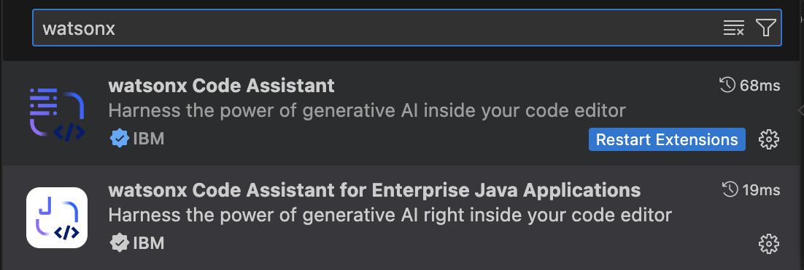
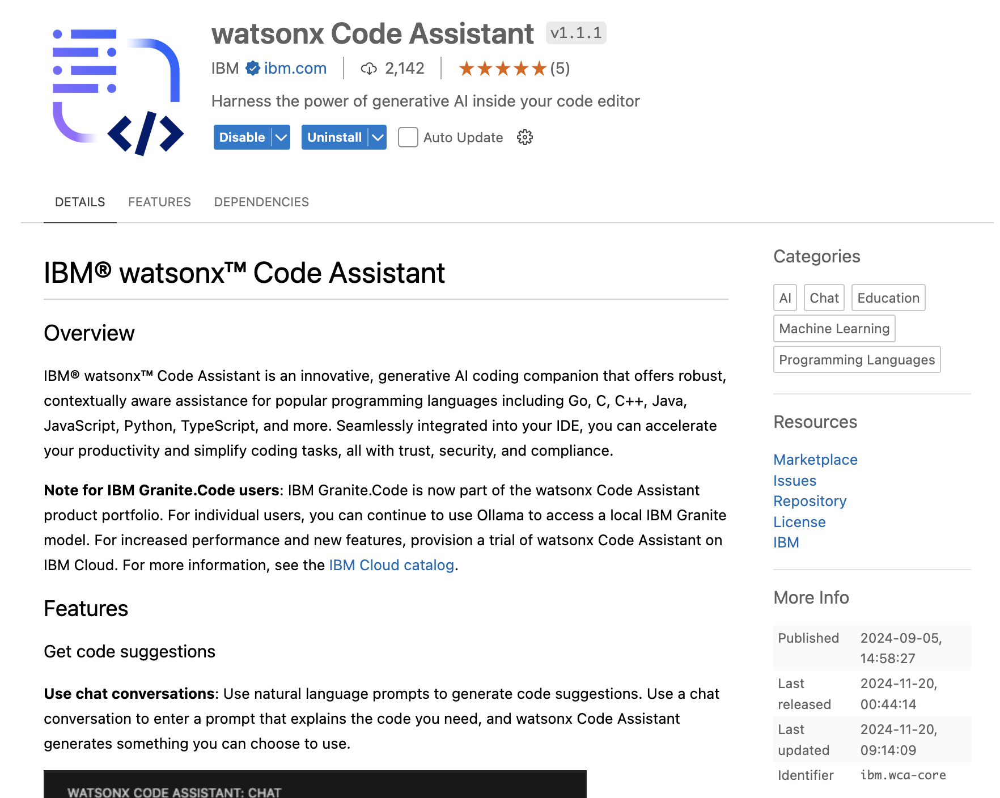
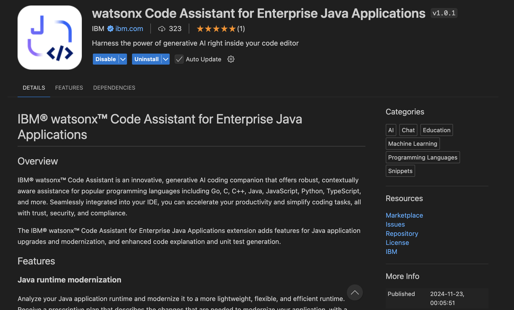
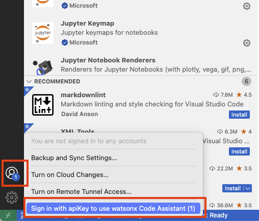
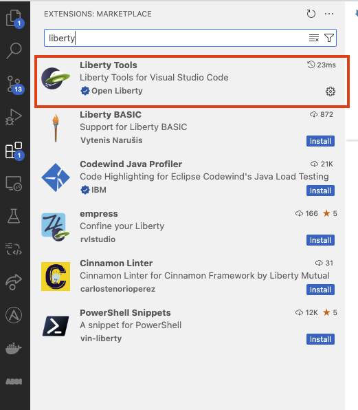
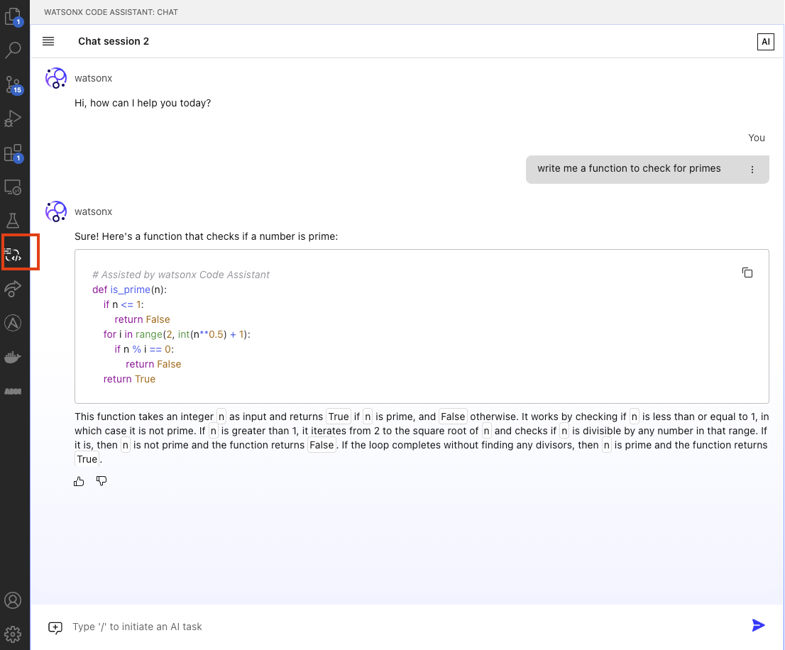

# Installation guide for WCA on VSCode

This document gives infomration on installing software tools with IDE VSCode that are needed to run ***Watson Code Assistant For Enterprise Java*** **(WCA4EJ)**

Last updated: Nov 26th, 2024

## Environment setup 

### 1. Java installation

#### Install Java21 using this link:
- [Download Java for MacOS - Arm64](https://download.oracle.com/java/21/latest/jdk-21_macos-aarch64_bin.tar.gz)
- [Download Java for MacOS - x86](https://download.oracle.com/java/21/latest/jdk-21_macos-x64_bin.tar.gz)
- [Download Java for Windows](https://download.oracle.com/java/21/latest/jdk-21_windows-x64_bin.zip)

All the above are compressed files, you can extract them to any folder in your local.

- Check if Java is installed properly:
```bash
java --version
```

- After installing java, add java to `PATH` variable and set `JAVA_HOME` envitonment variable
- **For Mac**:
  - Open .zshrc or .bash_profile
      ```bash
      nano ~/.zshrc
      ```
  - Add the following lines
      ```bash
      export JAVA_HOME=/Library/Java/JavaVirtualMachines/<java version>/Contents/Home
      ```
      ```bash
      export PATH=$JAVA_HOME/bin:$PATH
      ```
  - Save the file and exit (press CTRL + X, then Y, and hit Enter)
  - Reload the shell configuration so the changes take effect.
      ```bash
      source ~/.zshrc
      ```
  - Verify the JAVA_HOME with the following command:
      ```bash
      echo $JAVA_HOME
      ```
- **For Windows**:
  - Open Environment variables using windows search bar (search for edit environment variables in the search bar)
  
  

  - Set JAVA_HOME variable using Environment variables (click on new if you do not have a JAVA_HOME set or click on edit to change the existing JAVA_HOME, and point it to the Java you installed in the earlier steps:
    
  

    ```bash
    JAVA_HOME= C:\Program Files\Java\jdk-21
    ```
    
  - Add Java to PATH using Environment variables:
 
  
 
    ```bash
    %JAVA_HOME%\bin
    ```


### 2. Install Maven

- **For Windows**
    - Visit the official Maven website: [Maven Download Page](https://maven.apache.org/download.cgi)
    - Under "Files", click on the binary zip archive link (e.g., apache-maven-x.x.x-bin.zip). 
    - Extract the zip file to a location of your choice, e.g., C:\Apache\maven.
    - Set MAVEN_HOME variable using Environment variables:
      ```bash
      MAVEN_HOME= <path-to-folder>\maven\apache-maven-3.9.9-bin\apache-maven-3.9.9
      ```
    - Add Maven to PATH using Environment variables: 
      ```bash
      <path-to-folder>\maven\apache-maven-3.9.9-bin\apache-maven-3.9.9\bin
      ```
- **For Mac**
   - Install maven using homebrew
      ```bash
      brew install maven
      ```
   - Check if maven is installed properly:
      ```bash
      mvn --version
      ```


### 3. Install VSCode

- [VSCode Official Website](https://code.visualstudio.com/download) for installation


### 4. WCA API Key (request access to environment)

Request WCA environment:
  - Request an IBM watsonX Code Assistant for Enterprise Java environment from https://techzone.ibm.com/collection/wca/environments
- You will receive an email from IBM Cloud asking you to join an account (e.g. itz-watsonx-99). Click the Join Now link in the email and log into IBM Cloud with your IBM ID to join the account.

Setup the WCA environment:
- Once you receive Reservation Ready email from TechZone, open your TechZone reservation by clicking View My Reservations and then selecting your WCA reservation.
- In your reservation, scroll down to the Reservation Details section and click the WCA URL link. Log into IBM Cloud with your IBM ID.
- In the welcome page, note the name of your service in the upper left corner (e.g. itzwca-4100005de8-xasw4qm3). It is based on your own IBM Cloud IAM ID and a unique identifier assigned to your reservation.
- Click the Launch watsonx Code Assistant button to open the WCA UI.
- Click Set up to launch the setup wizard.
- Click the arrow for Create deployment space.
- Enter a name for the deployment space.
  - Select your code assistant service (e.g. itzwca-4100005de8-xasw4qm3).
  - Find and select your storage service. It should look similar to your WCA service name, but starts with “itzcos” (e.g. itzcos-4100005de8-xasw4qm3).
  - Click the Create button.
  - Once it is created, click the X to close the “The space is ready” window.
- Click the arrow for Create an access group in your IBM Cloud account.
  - Your access group should already be created (e.g. itzwca-xasw4qm3).
  - Close the tab and return to the setup screen tab.
  - Click the checkbox for this item on the setup screen.
- Click the arrow for Invite developers to your IBM Cloud account.
  - If you are working with other developers, add them to your IBM Cloud account.
  - Close the tab and return to the setup screen tab.
  - Click the checkbox for this item on the setup screen.
- Click the arrow for Ask developers to log in to watsonx Code Assistant.
  - If you are working with other developers, follow the instructions given.
  - Close the tab and return to the setup screen tab.
  - Click the checkbox for this item on the setup screen.
- Click the arrow for Add the developers to the deployment space as collaborators.
  - If you are working with other developers, add them to your deployment space.
  - Close the tab and return to the setup screen tab.
  - Click the checkbox for this item on the setup screen.
- Click the arrow for Ask developers to create an API key.
  - Go to https://cloud.ibm.com/iam/apikeys.
  - Ensure that you’re in the itz-watsonx-## account you previously joined (see the current account name in the upper-right).
  - Create an API key and copy/paste the key somewhere for safekeeping.
  - (If you are working with any developers then have each of them perform the previous three steps)
  - Close the tab and return to the setup screen tab.
  - Click the checkbox for this item on the setup screen.
  - Scroll down and click the Get started button.

### 5. Download WCA extension

Download watsonx Code Assistant and watsonx code assistant for enterprise Java extensions from Marketplace



Install both the above extensions.

For more details you can see the product page of respective extensions.





### 6. Login into WCA


#### After installing the extension from **Step 5**, 

- Login with WCA API Key at the bottom left corner of VSCode. After successfully signed in, the number indicator should be gone.




### 7. Installing Liberty Tools and Java Extension

Install the Liberty Tools and extension Pack for Java extensions from VSCode marketplace as shown below.




### 8. Start Using WCA

You can check by navigating to the **watsonx Code Assistant** tab if your API Key is setup correctly by opening the chat window of WCA and chat with the model.




## Important Information
- [Asset Owner Contact](https://ibm.enterprise.slack.com/user/@U05UEGSKPGE)
