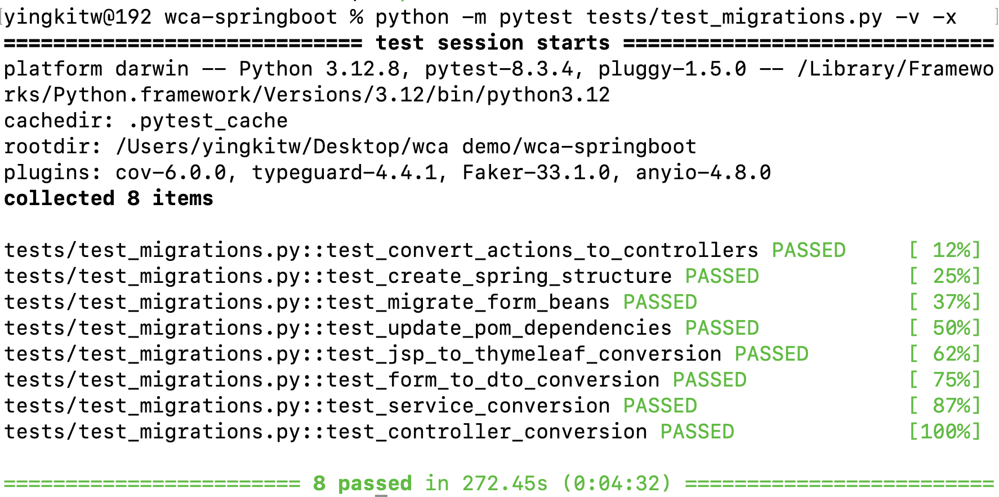

# Java Code Migration Tool

A command-line tool for migrating Java code between different frameworks and specifications, powered by watsonx Code Assistant (WCA) API.

[Owner Contact](https://ibm.enterprise.slack.com/archives/D08EJANBT8A)

## Features

- **Specific Migrations**:
  - Struts → Spring Boot
  - EJB → POJO
  - Gradle → Maven

## About

This tool leverages IBM's watsonx Code Assistant (WCA) API to:
- Analyze Java code for modernization opportunities
- Generate migration recommendations
- Transform code between different Java frameworks and specifications
- Preserve business logic while updating implementation patterns
- Convert build configurations between different build systems

## Installation

1. Clone the repository:
```bash
git clone https://github.ibm.com/watsonx-apac/wca-springboot.git
cd wca-springboot
```

2. Install dependencies:
```bash
pip install -r requirements.txt
```

3. Set up your IBM Cloud API key in `.env` file:
```bash
IAM_APIKEY=your_api_key_here
```

## Usage

### Specific Migrations

#### Struts to Spring Boot

Migrate Struts applications to Spring Boot:

```bash
python wca_springboot.py migrate-structs ./path/to/struts/app
```

By default, the migrated Spring Boot application will be created in `./output/spring-app`. 
You can specify a different output location using the `--output` option:

```bash
python wca_springboot.py migrate-structs ./path/to/struts/app --output ./custom/output/path
```

The migration process:
- Converts Struts Actions to Spring Controllers
- Transforms Form beans to Spring DTOs with validation
- Migrates JSP views to modern templates
- Sets up Spring Boot project structure
- Updates dependencies and configuration

#### EJB to POJO

Migrate EJB code to POJOs:

```bash
python wca_springboot.py migrate-ejb-to-pojo path/to/EJBFile.java --output POJOFile.java
```

#### Gradle to Maven

Convert Gradle build files to Maven:

```bash
python wca_springboot.py migrate-gradle-to-maven build.gradle --output pom.xml
```

## Options

Common options available for all commands:

- `--output`, `-o`: Specify output file path
- `--verbose`, `-v`: Show detailed progress (review command only)

## Sample Files

The `sample/` directory contains example files for each migration type:

```
sample/
├── structs/                    # Struts 1.x sample application
│   ├── src/
│   │   ├── main/
│   │   │   ├── java/
│   │   │   │   └── com/
│   │   │   │       └── example/
│   │   │   │           └── app/
│   │   │   │               ├── action/
│   │   │   │               ├── form/
│   │   │   │               └── model/
│   │   │   ├── resources/
│   │   │   └── webapp/
│   │   │       ├── WEB-INF/
│   │   │       └── pages/
│   │   └── pom.xml
├── ejb/
│   └── CustomerService.java    # EJB service
└── gradle/
    └── build.gradle           # Gradle build file
```

### Struts Sample Application

The Struts sample application (`sample/structs/`) demonstrates:
- Customer management (CRUD operations)
- Form handling with ActionForm
- JSP views with Struts tags
- Standard Struts 1.x configuration
- Maven project structure

## Migration Details

### Struts → Spring Boot
- Converts Actions to RestControllers
- Transforms ActionForms to validated DTOs
- Updates request/response handling
- Adds Spring Boot annotations
- Configures dependency injection
- Sets up modern project structure

### EJB → POJO
- Removes EJB-specific code
- Adds Spring/CDI annotations
- Updates transaction handling
- Migrates to JPA for persistence
- Implements dependency injection

### Gradle → Maven
- Converts project structure
- Maps dependencies and scopes
- Configures plugins
- Preserves build settings
- Handles Spring Boot configuration
- Includes proper DTD declarations

## Requirements

- Python 3.8+
- IBM Cloud API key
- Java source files to analyze/migrate

## Dependencies

- typer: CLI interface
- rich: Terminal formatting
- python-dotenv: Environment variable management
- requests: API communication

## Testing

Run the test suite:

```bash
pytest tests/test_migrations.py -v
```



sample output folder `output/spring-app`