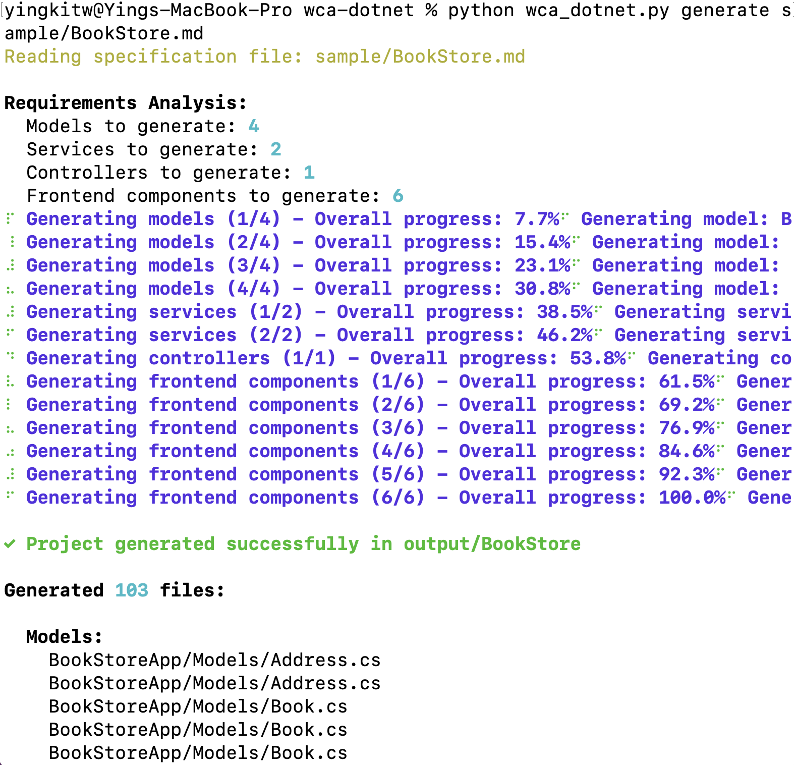

# .NET Code Analysis and Generation Tool

A command-line tool for generating unit tests and creating .NET projects from technical specifications using AI assistance.


[Owner Contact](https://ibm.enterprise.slack.com/archives/D08EJANBT8A)


## Features

- Generate unit tests for .NET code
- Create complete .NET projects from markdown specifications
- Support for multiple test frameworks (xUnit, NUnit, MSTest)
- Clean code generation following best practices
- Detailed output and progress tracking

## Prerequisites

- Python 3.7+
- IBM Cloud API key (set in `.env` file)

## Installation

1. Clone the repository
2. Install dependencies:
```bash
pip install -r requirements.txt
```
3. Create a `.env` file with your IBM Cloud API key:
```
IAM_APIKEY=your_api_key_here
```

## Usage

### Generate Unit Tests

Generate unit tests for a .NET source file:

```bash
python wca_dotnet.py unittest path/to/source.cs [options]
```

Options:
- `--framework`, `-f`: Test framework to use (xunit/nunit/mstest) [default: xunit]
- `--output`, `-o`: Output file for unit tests
- `--verbose`, `-v`: Show detailed progress

Example:
```bash
python wca_dotnet.py unittest MyClass.cs --framework xunit --output MyClassTests.cs
```

### Generate Project from Specification

Generate a complete .NET project from a markdown specification:

```bash
python wca_dotnet.py generate path/to/spec.md [options]
```

Options:
- `--output`, `-o`: Output directory for generated project
- `--name`, `-n`: Project name (defaults to spec file name)
- `--verbose`, `-v`: Show detailed progress

Example:
```bash
python wca_dotnet.py generate project_spec.md --output MyProject --name MyProjectName
```

## Technical Specification Format

The markdown specification should include:

```markdown
# Project Name

## Overview
[Project description]

## Features
- Feature 1
- Feature 2

## Technical Requirements
- .NET version
- Dependencies
- etc.

## Data Models
[Data model descriptions]

## API Endpoints
[API endpoint specifications]
```

## Generated Project Structure

The tool generates a complete project structure including:

- Source code files
- Project configuration
- Unit test structure
- Documentation
- Dependency setup
- Logging integration

## Best Practices

The generated code follows:
- SOLID principles
- Clean architecture patterns
- Modern .NET features
- Security best practices
- Performance considerations
- Proper documentation

## Output

- Generated code is saved as individual files in the specified directory
- Documentation is created in the `docs` folder
- Unit tests are saved either as `.cs` files or markdown
- Progress and results are displayed in the console

## Error Handling

- Detailed error messages with optional verbose output
- Proper exception handling and logging
- Input validation and error recovery

## Dependencies

- rich: Console output formatting
- typer: Command-line interface
- python-dotenv: Environment variable management
- wca_backend: IBM Cloud API integration
