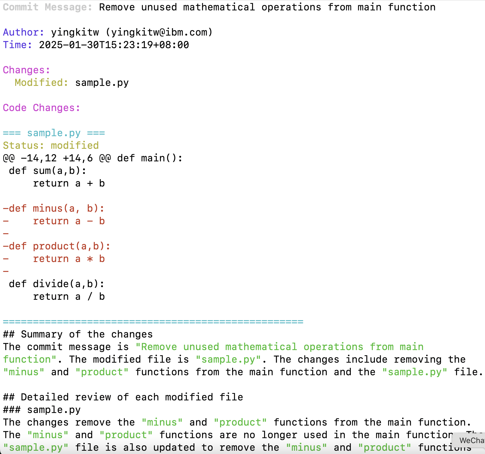
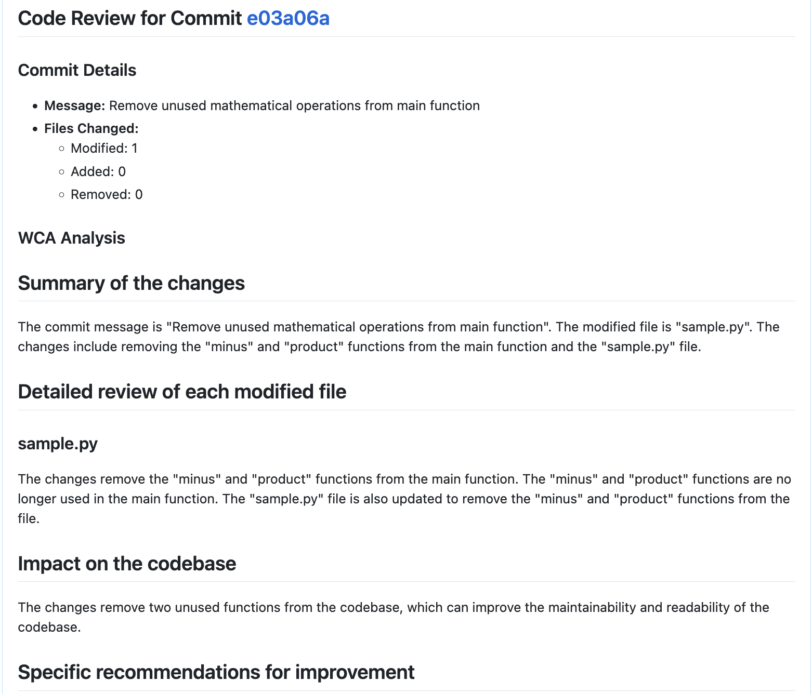

# GitHub Webhook Handler with WCA Code Review

A Python application that leverages Watson Code Assistant (WCA) to provide automated, intelligent code reviews for your GitHub commits. The application monitors repository events in real-time and generates comprehensive code analysis through GitHub issues.

## Key Features

### 1. Real-time Commit Monitoring
- Receives GitHub webhook events via smee.io
- Auto-reloads on code changes for easy development
- Secure webhook signature verification (optional)

### 2. Intelligent Code Analysis
- **Full Context Review**: Analyzes both changes and entire file contents
- **Professional Standards**: Maintains high standards of code review
- **Comprehensive Analysis**:
  - Code quality and readability assessment
  - Best practices evaluation
  - Potential issues identification
  - Specific improvement recommendations



### 3. Rich Console Output
- **Colorful Display**:
  - Commit messages in bright white
  - Author and timestamp in blue
  - File changes with status indicators:
    - Modified files in yellow
    - Added files in green
    - Removed files in red
  - Code diffs with syntax highlighting



### 4. Detailed GitHub Issues
- Creates a GitHub issue for each commit with:
  - Commit details and direct links
  - File changes summary with emoji indicators
  - WCA's comprehensive analysis
  - Links to all changed files
- Professional and concise feedback
- Direct and actionable recommendations

## Prerequisites

- Python 3.x
- Node.js (for smee-client)
- GitHub repository with webhook access
- GitHub Personal Access Token with repo scope
- Watson Code Assistant API key

## Installation

1. Clone the repository:
   ```bash
   git clone <your-repo-url>
   cd <your-repo-directory>
   ```

2. Install Python dependencies:
   ```bash
   pip install -r requirements.txt
   ```

3. Install smee-client globally:
   ```bash
   npm install --global smee-client
   ```

## Configuration

1. Set up smee.io:
   - Visit https://smee.io/new
   - Copy the URL provided

2. Create a `.env` file in the project root:
   ```bash
   # Required: Your smee.io URL for webhook forwarding
   export SMEE_URL='https://smee.io/your-unique-url'
   
   # Required: GitHub personal access token for API access
   export GITHUB_TOKEN='your-github-token'
   
   # Required: Watson Code Assistant API key
   export IAM_APIKEY='your-wca-api-key'
   
   # Optional: Webhook secret for added security
   export GITHUB_WEBHOOK_SECRET='your-webhook-secret'
   ```

3. Configure GitHub webhook:
   - Go to your repository's Settings > Webhooks
   - Click "Add webhook"
   - Set Payload URL to your smee.io URL
   - Content type: application/json
   - Secret: Optional, same as GITHUB_WEBHOOK_SECRET if you set it
   - Select events: Choose "Just the push event"


## Running the Application

1. Start the smee client (in one terminal):
   ```bash
   smee -u <your-smee-url> -t http://localhost:8000/webhook/github
   ```

2. Start the webhook server (in another terminal):
   ```bash
   python main.py
   ```

The server will:
- Run on http://localhost:8000
- Auto-reload when you make code changes
- Receive webhooks through smee.io
- Display commit information in real-time
- Show code diffs with syntax highlighting
- Create detailed code review issues

## Example Output

When you push commits to your repository, you'll see:

1. Console Output:
```
==================================================
Commit Message: Add user authentication module

Author: username (email@example.com)
Time: 2025-01-30T14:26:30+08:00

Changes:
  Modified: auth.py
  Added: tests/test_auth.py

Code Changes:
=== auth.py ===
Status: modified
@@ -1,5 +1,15 @@
+ def validate_user(username, password):
+     ...
==================================================
```

2. GitHub Issue:


## Troubleshooting

1. Webhook not receiving events:
   - Verify smee client is running
   - Check GitHub webhook settings
   - Ensure correct smee.io URL in both GitHub and .env

2. Code review not appearing:
   - Check if GITHUB_TOKEN and IAM_APIKEY are properly set
   - Verify token has necessary repository permissions
   - Ensure the repository is accessible to the token

3. Server errors:
   - Check server logs for detailed error messages
   - Verify all environment variables are properly set
   - Make sure you're running both smee client and the server